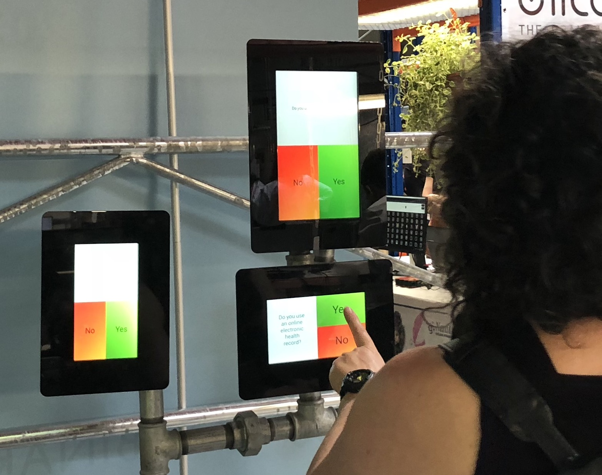
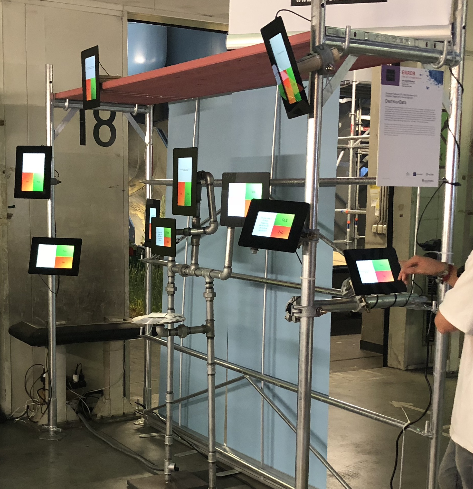
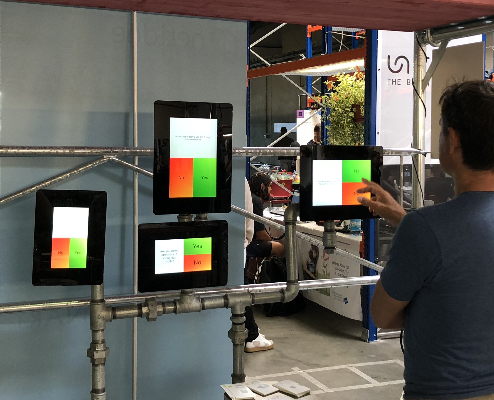
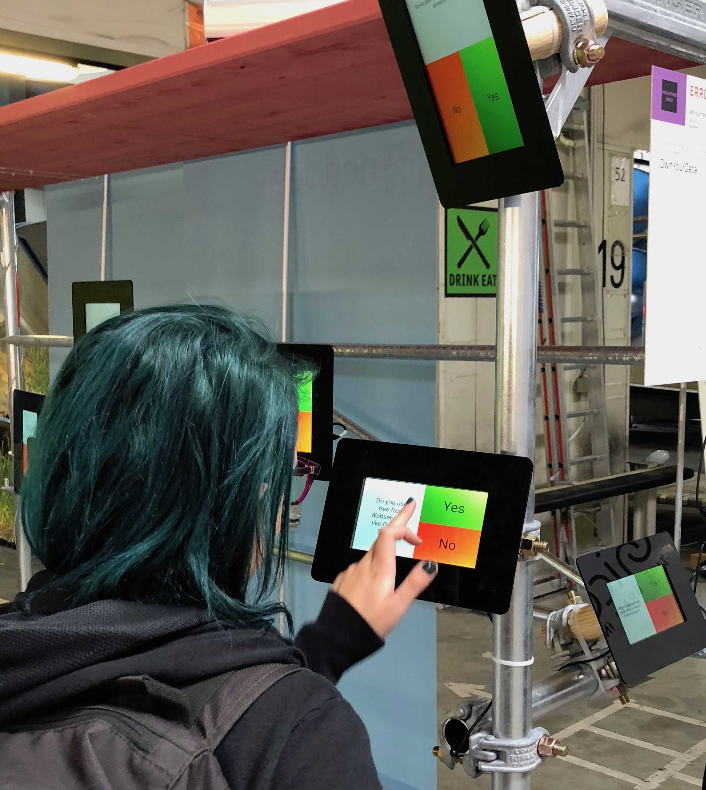
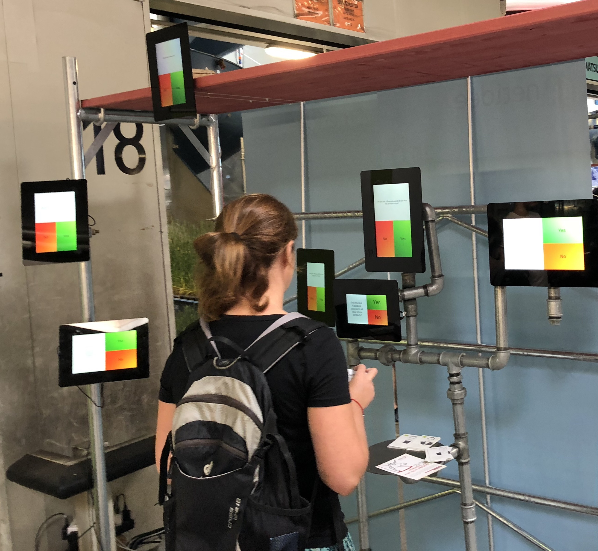
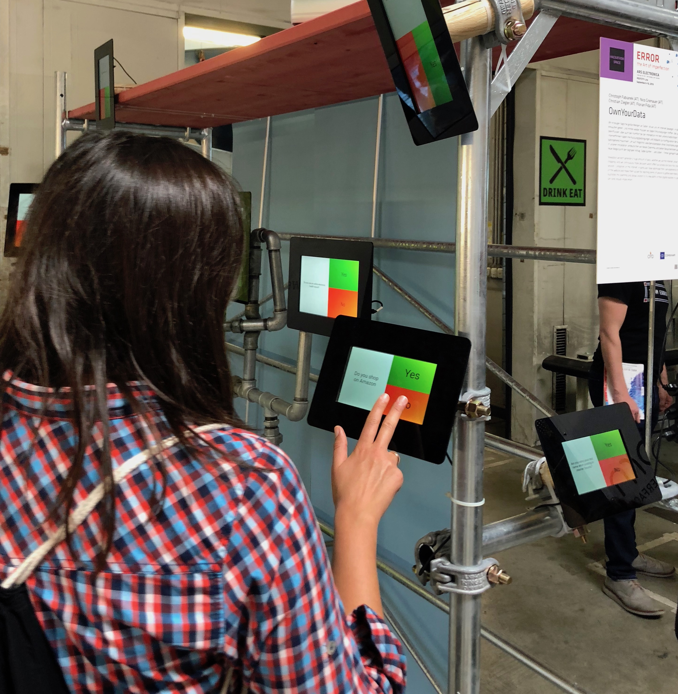
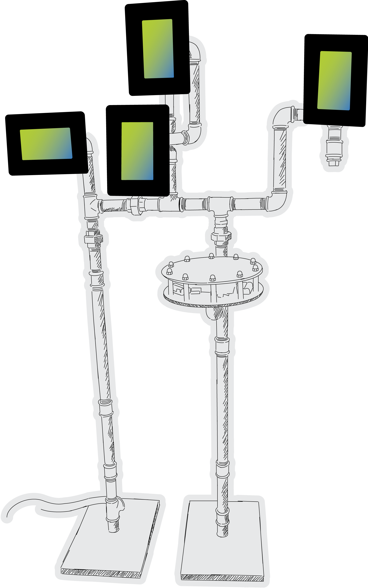

# Installation at ARS ELECTRONICA Festival 2018
[Exhibition page](https://ars.electronica.art/error/en/yourdata/)

Nowadays we each generate a huge amount of data, whether we use the internet, drive to work, or go grocery shopping. And we continuously make decisions which affect our privacy but also the convenience of using new services. Companies on the internet, in particular, have optimized their user experience in order to keep visitors on the website and make them accept far-reaching terms of service to gather ever more data. Our installation illustrates this dilemma and allows visitors to try new paths in their digital routine in a playful way. There they can – and should – make errors!

Christoph Fabianek (AT), Florian Fida (AT), Nico Grienauer (AT), Christian Ziegler (AT) 

